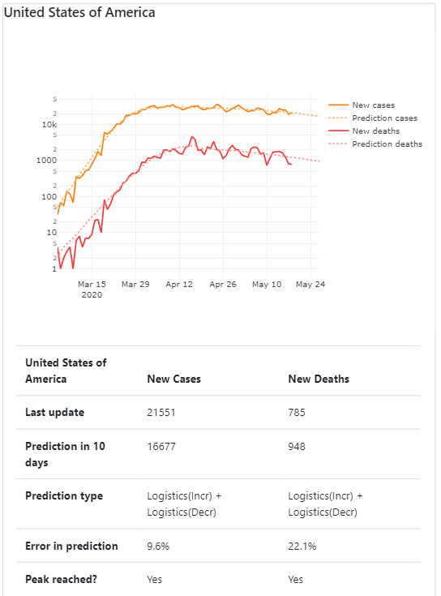
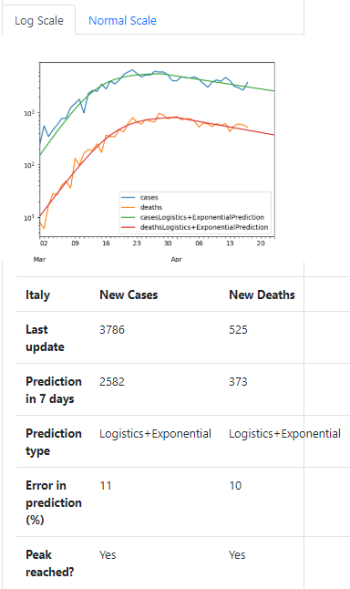
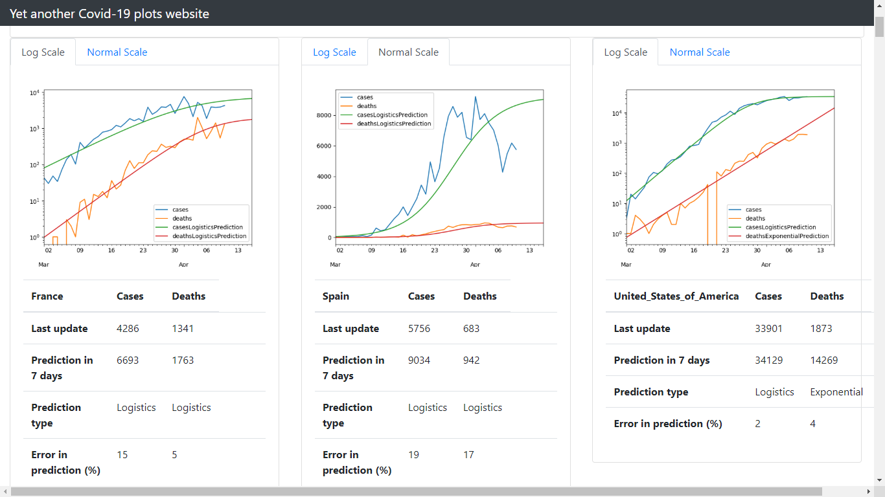

# covid-graph

Code for [covid-graph website](https://mathiasleborgne.github.io/covid-graph/): graphs and predictions for daily coronavirus cases and deaths.

Sources:
* [ECDC](https://www.ecdc.europa.eu/en/publications-data/download-todays-data-geographic-distribution-covid-19-cases-worldwide)
* [about-corona API](https://about-corona.net/)

## Misc Examples

| Example May 19 (USA) | Example April 17 (Italy) |
|----------------------|--------------------------|
| 
 | 
 |

## Example April 10

## Data processing

The curves for daily new cases and deaths are fit to a list of models, and the best model is used, amongst:

* an increasing exponential curve (when it doesn't look flat yet)
* or an increasing logistic curve (when it starts to flatten)
* or a decreasing logistic, exponential or linear curve (when the peak seems past).

Curve fitting uses `scipy.optimize.curve_fit`.
Based on this model, a 10-day prediction is inferred.

## Update

To update, push any commit on this server. An additional automatic commit will be triggered as a Github Action to update the site data (through API calls and scripts run).

## Install and build

    # make website data
    pip install requirements.txt
    python plot_covid.py --all --reload
    # build website
    cd docs/
    bundle exec jekyll serve
    # open in browser http://127.0.0.1:4000/

## Commands

    usage: plot_covid.py [-h] [--reload] [--start_date START_DATE]
                         [--country COUNTRY] [--favorite] [--all] [--show]
                         [--days_predict DAYS_PREDICT]

    optional arguments:
      -h, --help            show this help message and exit
      --reload              reload xlsx
      --start_date START_DATE
                            Date in format 2020-3-1
      --country COUNTRY     Select a specific country
      --favorite            Favorite countries
      --all                 All countries
      --show                Show images
      --days_predict DAYS_PREDICT
                            Number of days to predict in the future
