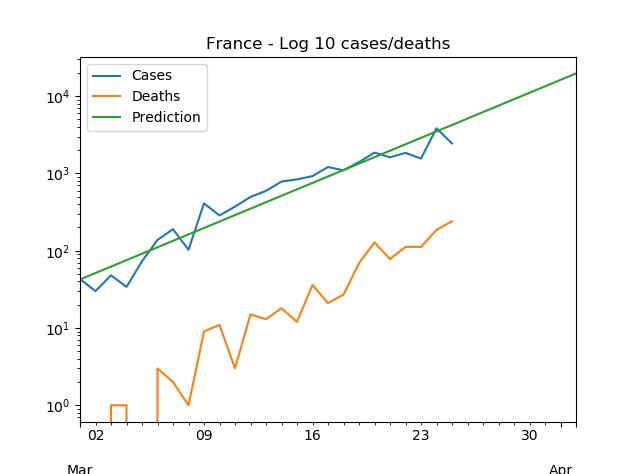

# covid-graph

This repo makes graphs for coronavirus cases from [this data source](https://www.ecdc.europa.eu/en/publications-data/download-todays-data-geographic-distribution-covid-19-cases-worldwide)
to publish them to [this github page](https://mathiasleborgne.github.io/covid-graph/).

## Install and build

    # make website data
    pip install requirements.txt
    python plot_covid.py --all --reload
    # build website
    cd docs/
    bundle exec jekyll serve
    # open in browser http://127.0.0.1:4000/
