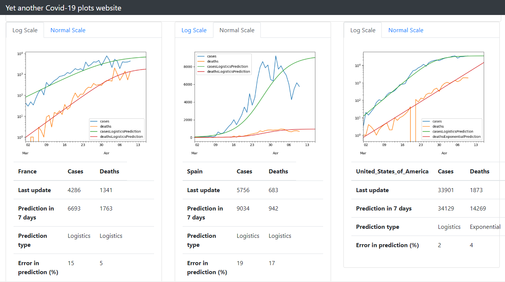

# covid-graph

Code for [covid-graph website](https://mathiasleborgne.github.io/covid-graph/): 
graphs and predictions for coronavirus daily cases and deaths.

## Stack

* Python scripts:
    + requests: fetch data (Excel/JSON)
    + pandas: containers for data
    + numpy/pwlf: curve_fitting and other utilities
    + gitpython: automatic commits for update.
* Web:
    + Jekyll: static web pages generation
    + Plotly: javascript tool for data charts
    + bootstrap: quick and nice rendering
    + GitHub Actions: run the scripts and save data changes in a commit

## Miscellaneous Examples

| Example May 19 (USA) | Example April 17 (Italy) |
|----------------------|--------------------------|
|  |  |

## Example April 10

## Sources

Sources:
* [ECDC](https://www.ecdc.europa.eu/en/publications-data/download-todays-data-geographic-distribution-covid-19-cases-worldwide)
* [about-corona API](https://about-corona.net/)

The "smoother" source is chosen (i.e. with smallest error compared to the curved smoothened with a 7-days window).

## Predictions

The curves for daily new cases and deaths (per million inhabitants) are fit to a list of models, and the best model is used, amongst:

* an increasing exponential curve (when it doesn't look flat yet)
* or an increasing logistic curve (when it starts to flatten)
* or a decreasing logistic, exponential or linear curve (when the peak seems past).
* or a piecewise linear fit in the log scale.

Curve fitting uses :
* `scipy.optimize.curve_fit`
* or `pwlf` (piecewise linear fit, used on log scale)

Based on this model, a 15-day prediction is inferred.

## Update

To update, push any commit on this server. An additional automatic commit will be triggered as a Github Action to update the site data (through API calls and scripts run).

## Install and build

    # make website data
    pip install requirements.txt
    python plot_covid.py --all --reload
    # build website
    cd docs/
    bundle exec jekyll serve
    # open in browser http://127.0.0.1:4000/

## Commands

    usage: plot_covid.py [-h] [--reload] [--start_date START_DATE]
                         [--country COUNTRY] [--favorite] [--all] [--show]
                         [--days_predict DAYS_PREDICT]

    optional arguments:
      -h, --help            show this help message and exit
      --reload              reload xlsx
      --start_date START_DATE
                            Date in format 2020-3-1
      --country COUNTRY     Select a specific country
      --favorite            Favorite countries
      --all                 All countries
      --show                Show images
      --days_predict DAYS_PREDICT
                            Number of days to predict in the future

